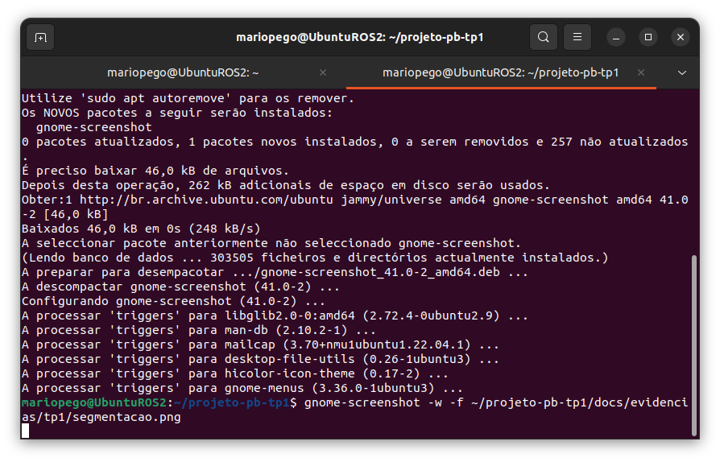
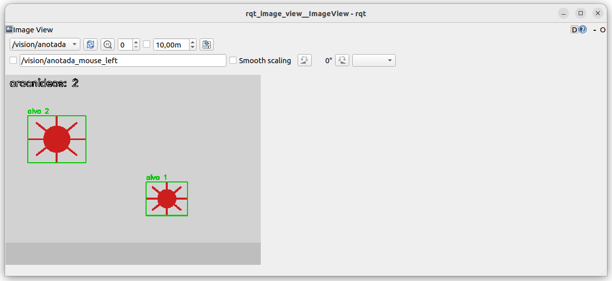

# Relatório TP1 — ARACNE

**Aluno:** João Rafael Broz dos Santos · **Disciplina:** Projeto de Bloco — Sistemas Robóticos
**Professor:** Dácio Moreira de Souza · **Data:** 28/08/2026
**Repositório:** https://github.com/Jr-Broz/projeto-pb-Jr-Broz · **Tag:** `tp1`
**Vídeo:** [COLE O LINK]

---

## 1. O projeto e por que ele

O ARACNE é um sistema perceptivo baseado em ROS 2 para identificação visual de aracnídeos por câmera. Derivei da família de projetos de percepção com câmera, especializando o domínio para quatro espécies brasileiras com resolução da linhagem taxonômica completa.

O Brasil registra milhares de acidentes anuais com aranhas, e boa parte da gravidade não vem da picada em si, mas do atraso na identificação — a conduta correta depende de saber a que gênero pertence o exemplar, e esse conhecimento não está disponível no momento do encontro. Do ponto de vista robótico, é percepção visual em ambiente não controlado: o agente observa, segmenta a região de interesse, extrai características e classifica. É o mesmo pipeline de um robô de inspeção.

O que a derivação acrescenta é a resolução taxonômica desacoplada do modelo: a rede prediz apenas a espécie, e a linhagem (reino a gênero) vem de uma tabela indexada, porque dada a espécie ela é consequência lógica, não inferência.

## 2. Decisões técnicas

### 2.1 Ambiente

Ubuntu 22.04 LTS em VirtualBox sobre host Fedora, usando o appliance `Ubuntu22.04ROS2Humble.ova` fornecido pela disciplina, com ROS 2 Humble já provisionado. Rota oficial, sem desvio.

Configuração: 4096 MB de RAM e 2 vCPU, limitados pelos 8 GB do host. A webcam Logitech C270 foi anexada por passthrough USB via Extension Pack.

O host exigiu trabalho adicional: o Fedora não distribui o VirtualBox nos repositórios padrão (RPM Fusion Free), e o Secure Boot rejeitou os módulos `vboxdrv` até que a chave do akmods fosse registrada via MOK. Registrado em `docs/decisoes.md`.

### 2.2 Segmentação por cor, não por forma

Segmentação em HSV separa matiz de intensidade, o que a torna mais estável a variações de iluminação do que limiarização em BGR. O alvo é vermelho, cujo matiz cruza o zero da roda de cores — por isso são **duas** faixas de H (0–10 e 170–180), unidas por `bitwise_or`.

Depois: abertura morfológica para remover ruído, fechamento para unir as pernas ao corpo, e filtro por área mínima (700 px) para descartar respingos.

### 2.3 Serviço `Trigger` em vez de interface própria

`/vision/status` usa `std_srvs/srv/Trigger`. Interface própria é o G2.0/G2.1 do TP2 — antecipar aqui seria fora de escopo. O campo `message` carrega a informação do domínio: contagem de aracnídeos candidatos, maior área e frames processados.

### 2.4 Fonte de imagem parametrizada

`camera_node` aceita `fonte:=webcam|video|sintetico`. Se a webcam não abrir, o nó **cai automaticamente** para a fonte sintética e registra um warning. Isso é o plano B do PROJETO.md implementado em código, não só declarado — e foi exercitado de verdade, conforme a seção 5.

### 2.5 Medição da taxa em `/vision/contagem`

A taxa foi medida em `/vision/contagem`, não em `/camera/image_raw`. O `ros2 topic hz` desserializa cada mensagem inteira em Python; a 15 fps são cerca de 13 MB/s passando pelo instrumento, que passa a medir a si mesmo se afogando. `/vision/contagem` são 4 bytes e anda junto do pipeline, servindo como régua leve.

---

## 3. Evidências

| Gate | Evidência | Estado |
|---|---|---|
| G1.0 | `docs/evidencias/tp1/check-ambiente.txt` | [x] |
| G1.1 | `PROJETO.md` | [x] |
| G1.2 | `docs/evidencias/tp1/topic-hz.txt` | [x] |
| G1.3 | `docs/evidencias/tp1/segmentacao.png` | [x] |
| G1.4 | `docs/evidencias/tp1/rqt_graph.png`, `servico-status.txt` | [x] |
| G1.5 | este documento | [x] |

Resposta do serviço, registrada em `servico-status.txt`:

ARACNE | candidatos a aracnideo no ultimo frame: 1 | maior area: 752 px
| frames processados: 344 | stamp: 1787957078.635

---

## 4. Experimento de oclusão

**Montagem:** dois alvos na cena com trajetórias que se cruzam, monitorando `/vision/contagem`.

| Situação | Contagem esperada | Contagem obtida |
|---|---|---|
| Dois alvos separados | 2 | 2 |
| Sobreposição parcial | 2 | 2 |
| Sobreposição total | 1 | 1 |

Ambas as situações têm evidência em arquivo: o print da seção 3 registra os dois alvos separados (`aracnideos: 2`), e `servico-status.txt` registra o instante de sobreposição, com contagem 1 e área de 752 px — maior que a de um alvo isolado, o que confirma a fusão das máscaras em vez da perda de um alvo.

**Análise:** a segmentação por cor com `RETR_EXTERNAL` trata regiões conectadas como um contorno único. Quando dois alvos da mesma cor encostam, suas máscaras se fundem e a contagem cai — o sistema não "perde" o alvo, ele funde dois em um.

Isso é **limitação estrutural do método**, não bug de parâmetro: nenhum ajuste de faixa HSV separa dois objetos da mesma cor em contato. A separação exige watershed, análise de convexidade, ou segmentação por instância (G3.4, TP3).

---

## 5. Limitações conhecidas

1. **Segmentação por cor não identifica espécie.** O TP1 conta objetos de uma faixa cromática. O classificador entra no G4.6, no TP4.
2. **Oclusão funde alvos**, conforme a seção 4.
3. **Sensível ao fundo.** Qualquer objeto vermelho na cena é contado.
4. **Passthrough USB instável.** A webcam foi negociada com sucesso (`webcam negociada: 640x480 MJPG @30fps`) e operou por vários minutos, mas o dispositivo se desanexou durante a sessão e `/dev/video0` deixou de existir sem intervenção. O `camera_node` degradou automaticamente para a fonte sintética, sem interromper o grafo — o comportamento pretendido. As evidências finais foram capturadas em fonte sintética por essa razão.
5. **Repositório fora da organização.** O repositório do GitHub Classroom não estava disponível na organização Prof-Dacio-INFNET no momento da entrega. O trabalho foi versionado em `github.com/Jr-Broz/projeto-pb-Jr-Broz`, partindo do `PBRoboticos_template_aluno`, com a estrutura e o fluxo de branches preservados. Migro para o repositório oficial assim que ele for disponibilizado.
6. **Gates executados fora das datas recomendadas**, concentrados em 28/08.

---

## 6. Uso de IA declarado

**Ferramenta:** Claude (Anthropic).

**Onde foi usada:**
- Estruturação do `PROJETO.md` e deste relatório, a partir de decisões que eu
  defini: domínio (aracnídeos), as quatro espécies e o recorte do escopo.
- Escrita inicial dos nós `camera_node` e `vision_node`, incluindo a escolha
  das duas faixas de matiz para o vermelho e a sequência de operações
  morfológicas.
- Correção de rumo durante a sessão: o ambiente inicialmente proposto foi
  container Docker, e eu optei por VirtualBox por ser a rota oficial da
  disciplina e a usada em aula.
- Diagnóstico dos problemas de host: RPM Fusion, Secure Boot e MOK no Fedora.
- Explicação conceitual de ROS 2 (nós, tópicos, serviços, DDS), que eu pedi
  quando percebi que estava executando comandos sem entender a arquitetura.

**O que eu fiz sozinho:**
- Toda a montagem e depuração do ambiente: instalação do VirtualBox no Fedora,
  registro da chave MOK, recuperação do sistema após boot em kernel sem os
  módulos compilados, importação do appliance e redefinição de acesso à VM.
- Diagnóstico e correção do `ROS_LOCALHOST_ONLY` divergente entre terminais,
  que impedia os nós de se enxergarem.
- Anexação da webcam por `VBoxManage webcam attach` e observação do
  comportamento instável do passthrough.
- Execução de todos os comandos, captura das evidências e verificação de cada
  saída.
- Criação e configuração do repositório, branches e fluxo de entrega.

**O que eu verifiquei:**
- Rodei cada comando e conferi a saída antes de seguir. Quando o resultado não
  batia com o esperado, reportei e investiguei em vez de aceitar.
- Confirmei que os cinco arquivos de evidência existem e têm conteúdo real.
- Observei ao vivo o fallback da webcam para a fonte sintética, e a contagem
  de `/vision/contagem` correspondendo aos alvos visíveis no `rqt_image_view`.
- Testei a visibilidade pública do repositório.

**Observação:** o código foi escrito com assistência, mas eu depurei o
comportamento dele no meu ambiente e consigo explicar cada nó, cada tópico e
o motivo de cada decisão técnica listada na seção 2.
---

## 7. Próximos passos (TP2 — 25/09)

- G2.0/G2.1: pacote `percepcao_aracnideos_interfaces` com `SpiderID.msg` e `VisionStatus.srv`
- G2.2/G2.3: action de varredura com feedback periódico e cancelamento
- G2.4: detector com métrica declarada sobre vídeo fixo
- G2.5: parametrização YAML + URDF no RViz2
- Investigar a estabilidade do passthrough USB
